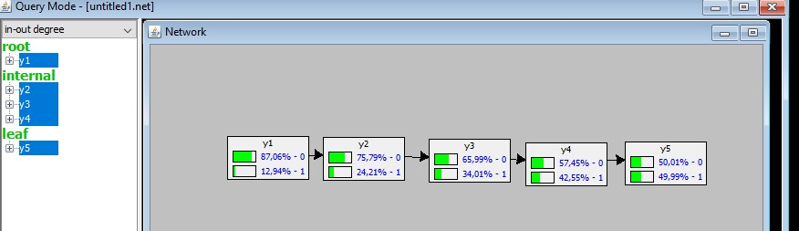

## Temporal Modeling

2020-05-19


```{r, include=FALSE}
knitr::opts_chunk$set(echo = TRUE, warning = F)
```

### Transition probabilities

- Consider 5 year survival for stage IV triple negative breast cancer patients is 50%
- How to model it, yearly?

We will use the functions given by the professor to compute **Rate** and **Probability**.

from probability to rate.
```{r}
rate <- function(p, t) {
  out <- c(-log(1 - p) / t)
  names(out) <- paste("Rate",t,"y",sep="")
  out
}
```

probability from one yearly time frame to another.
```{r}
prob <- function(p, t.orig = 5, t.final = 1) {
  out <- c(1 - exp( -rate(p, t.orig) * t.final))
  out
}
```

complement
```{r}
comp <- function(v){
  out <- rep(v, each=2)
  for (i in 2:length(out))
    if (i %% 2 == 0)
      out[i] <- 1 - out[i-1]
    out
}
```

In this exercise we apply the function `prob()` to have *Prob(y(n)|~y(n-1))*
```{r}
p1y<-prob(p = 0.5, t.orig = 5, t.final = 1)

comp(p1y)
```

With these probabilities we can compute the network in SamIam.

Those were the probabilities for *y1*, for the other 4 nodes the conditional probability table is as:


The result is as expected:


Now we add a new node for the subtype with probabilities 0.8 (luminal A) and 0.2 (tripleneg):


With the new probabilities we have to compute new conditional probability tables for each one of the years. 

We know that with tripleneg the 5 year survival is 50%, but luminal A subtype has a 5 year survival of 90%. So we have to compute the probabilities for lunimal A.
```{r}
p1yA<-prob(p = 0.9, t.orig = 5, t.final = 1)

comp(p1yA)
```

The _y1_ conditional table will have the table:


and for the other years, each one will be like:


The final result


Now you can play with it!!


